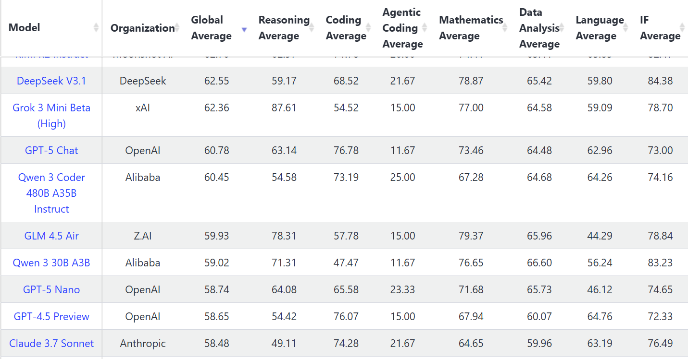
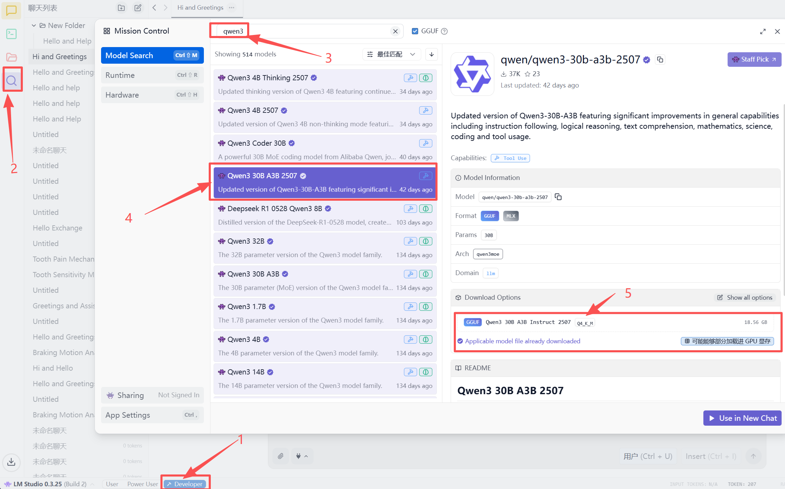
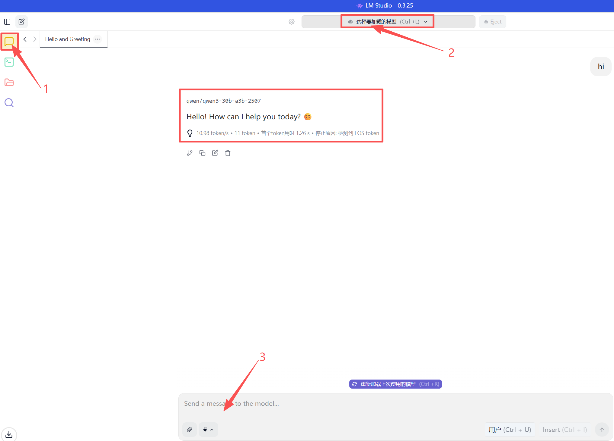
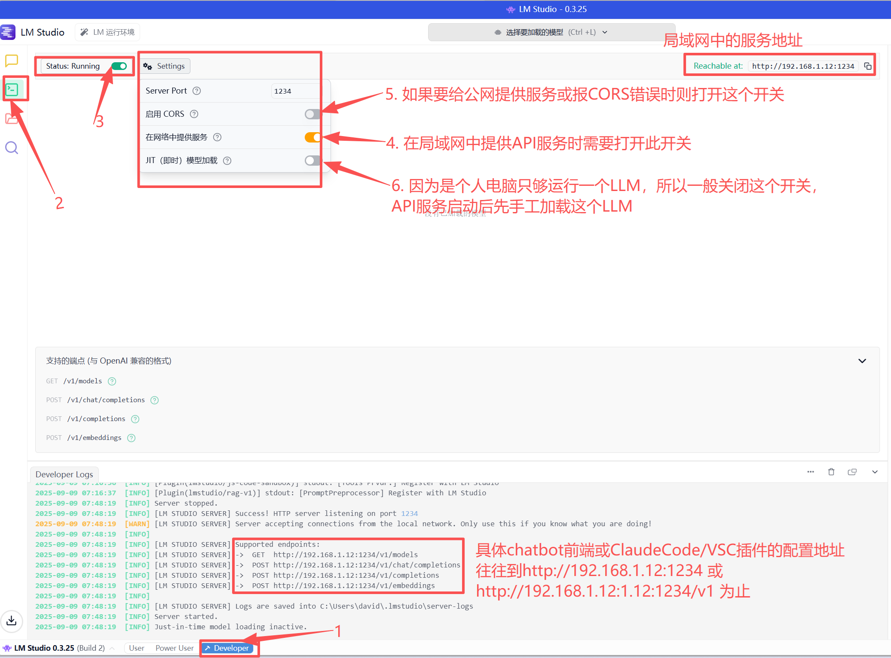

# 如何低成本打造个人本地LLM小模型 （By 2025/9）

## 1 选型
### 1.2 软件
[Ollama](https://ollama.com/) 最方便，小白友好，且可下载的模型最多，但GPU显存利用率不足 
[lmstudio.ai ](https://lmstudio.ai/) 既无需命令行适合小白，又功能多适合Power User和开发者，尤其GPU加载层数可调，GPU显存利率率高于Ollama，所以实际使用下来速度比Ollama至少快20%。所以本文实测使用lmstudio 
注：两者都是基于llama.cpp项目 

### 1.3 本地性价比高的小模型
[livebench.ai](https://livebench.ai/) 上发现32b以下模型最具性价比的是qwen3-30b-a3b-2507（25/7版又大大优于图中4月的版本），所以即使Q4（模型的显存+内存只有18GB，且为MoE模型，激活时实际参与计算的参数量只有3.3b，故推理速度极快）量化后实测仍然也不输GPT4.5了。同时其推理模型qwen3-30b-a3b-think-2507在数学、逻辑、编程上更强。并且两者都上下文都支持32K（可扩展到256K）支持Tool Use和最新的MCP，所以是个人本地LLM小模型的首选。 

### 1.3 硬件
本文实测使用联想Y7000p，4060m 8G显存，14代i7CPU,内存16GB；后来研究了各种小主机，发现了目前市场上性价比最高的小主机铭凡8745Slim32G DDR5-5600+1T硬盘国补只要2500元左右（核显达到N卡1060水平，BIOS可设最大16G显存+8G共享显存）

## 2 实战
### 2.1 去[lmstudio.ai ](https://lmstudio.ai/) 下载并安装lmstudio
### 2.2 打开lmstduio，如下图依次做，下载并安装qwen3-30b-a3b-2507

### 2.3 然后就可以在“Chat”界面里选择模型和LLM聊天了（如下图依次做）

### 2.4 最后lmstduio还可以在“开发者”界面为其他chatbot前端或者Claude Code/VS code插件提供LLM API服务（如果依次做即可）

Tip：
1、注意qwen3-30b-a3b-2507模型大小为18G，已经超过了4060的8G显存+Win11自动分配的8G共享显存（内存的一半），所以推理时用的是GPU+CPU混合推理，故速度是不高的，相当于此模型是Y7000p这台机器的极限挑战了，所以上下文长度最多也只能是4-32K 
2、另有更强的Qwen3-30B-A3B-Thinking-2507-GGUF 模型，但thinking模型思考时间更长，最终结果输出更慢，所以在4060上跑MCP有点勉强 
3、2.3中测试到的速度~10token/s是在Y7000p显卡65W普通电源供电的安静模式下，在其原装的230W大电源供电下能打开显卡的Wild模式（Fn+Q切换），速度能提高50%达到~15token/s

